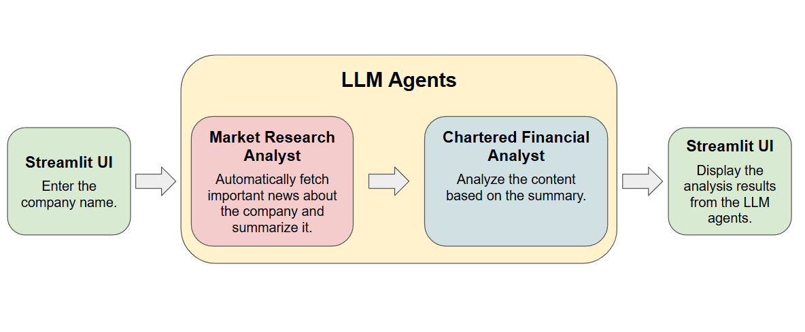
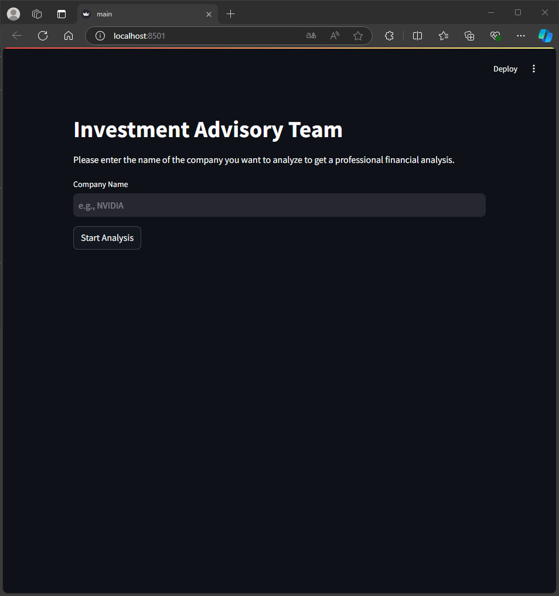
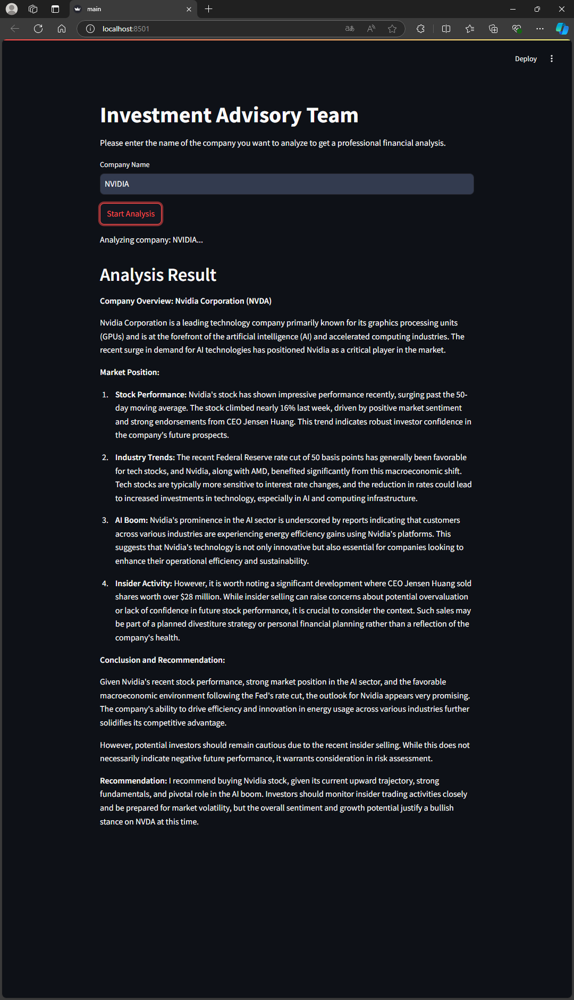

# Stock Analysis by LLM
## Overview

This application is built based on the project I participated in for the [Generative AI Agents Developer Contest by NVIDIA and LangChain](https://www.udemy.com/course/generative-ai-ai-agent-chatgpt-api-key/), as well as an Udemy course. Unlike my previous project, this one uses an LLM agent to automatically fetch the latest key news about the company and analyze it. Finally, it provides detailed investment recommendations for the company.



## How to Run

To run this program, follow these steps:

1. **Using Anaconda to create a Python=3.12 environment.**

    ```sh
    conda create --name stock_llm python=3.12
    ```

2. **Download this Project**

    ```sh
    git clone https://github.com/iamrock123/Stock-Analysis-by-LLM.git
    ```

3. **Install dependencies**

    ```sh
    pip install -r .\requirements.txt
    ```

4. **Set your API key in the .env file (including  and ChatGPT).**

    ```sh
    SERPER_API_KEY=""
    OPENAI_API_KEY=""
    CHATGPT_API_ENDPOINT="" #Since I am using GPT_API_free for testing, I need to set the API Endpoint. If you are directly using the ChatGPT API Key, please skip this step and modify line 13 of main.py.
    ```
    - [Serper](https://serper.dev/)
    - [GPT_API_free](https://github.com/chatanywhere/GPT_API_free)

4. **Run the Project**

    ```sh
    streamlit run ./main.py
    ```

    - If you have installed all the dependencies and executed the commands correctly, you will see the following screen.

    

### How to operate the GUI interface

Please follow the steps below to perform automatic annotation.

- Enter the company you want to analyze in the input box (eg. NVIDIA).
- Click the submit button, and wait for a while to get the investment analysis of the company.

    

## References

- [Serper](https://serper.dev/)
- [streamlit](https://streamlit.io/)
- [GPT_API_free](https://github.com/chatanywhere/GPT_API_free)
- [Generative AI第一部 - 從LangChain接入ChatGPT到製作股票分析AI團隊](https://www.udemy.com/course/generative-ai-ai-agent-chatgpt-api-key/)

